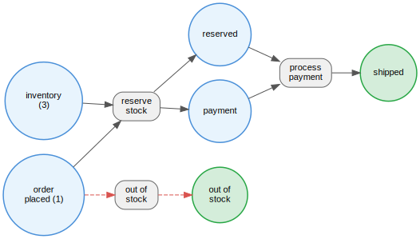
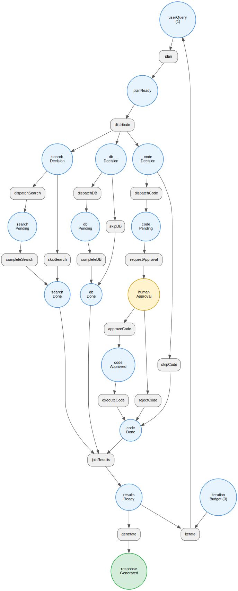

# PetriFlow

A workflow orchestration engine built on [petri-ts](https://github.com/joshuaisaact/petri-net). Extends Petri net semantics with guard functions, side-effect execution, SQLite persistence, a polling scheduler, and a CLI analyser.

## Why

DAG-based workflow tools (n8n, Airflow, Temporal) can't express concurrent synchronization, resource contention, or pre-deployment reachability analysis. Petri nets can. PetriFlow makes them practical.

- **Guards** route workflows based on runtime context (contract value, confidence score, inventory level)
- **Execute functions** run side effects and merge context between steps
- **The scheduler** polls active instances, fires enabled transitions, and persists state to SQLite
- **The analyser** proves properties about your workflow before it runs — deadlock freedom, token conservation, reachable states

## Packages

| Package | Description |
|---|---|
| `@petriflow/engine` | Core types, engine, scheduler, SQLite persistence, analysis |
| `@petriflow/cli` | `petriflow analyse <workflow.ts>` CLI tool |
| `@petriflow/viewer` | Interactive Petri net viewer — click to fire transitions, live analysis |

## Workflows

| Workflow | What it proves |
|---|---|
| `order-checkout` | Cannot oversell inventory. `reserve_stock` consumes from a shared `inventory` place. Every order terminates. |
| `agent-benchmark` | Termination, human approval gate, no orphaned work, bounded iterations. See [BENCHMARK.md](./BENCHMARK.md). |

### Order Checkout

<p align="center">
  
</p>

### Agent Benchmark

<p align="center">
  
</p>

## Viewer

An interactive React app for exploring Petri nets. Click enabled transitions to fire them, watch tokens flow, and see live reachability analysis.

```bash
bun run --filter=@petriflow/viewer dev
```

Four nets tell a progressive story:

| Net | Places | Transitions | What it teaches |
|---|---|---|---|
| **coffee** | 6 | 3 | Concurrency and synchronisation — `heatWater` and `grindBeans` fire independently, `pourOver` joins them |
| **order-checkout** | 6 | 3 | Resource contention — `reserve_stock` consumes from a shared `inventory` place with token count > 1 |
| **simple-agent** | 6 | 5 | Iteration loop with budget — watch the budget deplete, agent forced to respond when spent |
| **agent-benchmark** | 16 | 17 | Everything together — concurrent tool fan-out, human approval gate, join semantics, four safety proofs |

Features:

- **Click to fire** — click any enabled transition, watch marking update in real-time
- **Auto-play** — random firing with adjustable speed, stops at terminal state
- **Live analysis** — reachable states, terminal states, deadlock-free status, safety properties and invariants
- **Token display** — toggle between numbers and traditional Petri net dot notation
- **Light/dark theme** — toggle in the header

Built with React 19, React Flow, dagre layout, framer-motion, and Tailwind CSS v4. Uses `@petriflow/engine/analyse` for workflow-aware analysis (distinguishes valid terminal states from true deadlocks).

## Quick start

```bash
bun install
```

Run a workflow end-to-end:

```bash
bun run workflows/order-checkout/index.ts
bun run workflows/agent-benchmark/index.ts
```

Analyse a workflow:

```bash
bun packages/cli/src/cli.ts analyse workflows/agent-benchmark/index.ts
```

With `--strict` (exits 1 on unexpected terminal states or invariant violations — use in CI):

```bash
bun packages/cli/src/cli.ts analyse workflows/order-checkout/index.ts --strict
```

Run all tests:

```bash
bun test
```

## How it works

`WorkflowTransition` is an intersection type with petri-ts's `Transition`, adding optional `guard`, `execute`, and `timeout`. Because TypeScript uses structural typing, a `WorkflowNet` passes directly to all petri-ts analysis functions — no conversion needed.

When you need a clean `PetriNet` (for serialization or analysis), `toNet()` strips the extensions. The analyser calls `petri-ts`'s `analyse()` under the hood and adds the workflow name.

```ts
import { defineWorkflow, analyse, Scheduler } from "@petriflow/engine";

const definition = defineWorkflow({
  name: "my-workflow",
  places: ["start", "end"],
  transitions: [
    {
      name: "go",
      inputs: ["start"],
      outputs: ["end"],
      guard: (ctx) => ctx.ready,
      execute: async (ctx) => ({ done: true }),
    },
  ],
  initialMarking: { start: 1, end: 0 },
  initialContext: { ready: true, done: false },
});

// Prove properties before running
const result = analyse(definition);
// result.isDeadlockFree, result.terminalStates, result.invariants

// Run it
const scheduler = new Scheduler(definition, { db });
await scheduler.createInstance("instance-1");
await scheduler.tick();
```

## Built with

- [petri-ts](https://www.npmjs.com/package/petri-ts) — Petri net engine and analysis
- [Bun](https://bun.sh) — runtime, test runner, bundler
- [Turborepo](https://turbo.build) — monorepo orchestration
- [React Flow](https://reactflow.dev) — graph rendering for the viewer
- [dagre](https://github.com/dagrejs/dagre) — automatic graph layout
